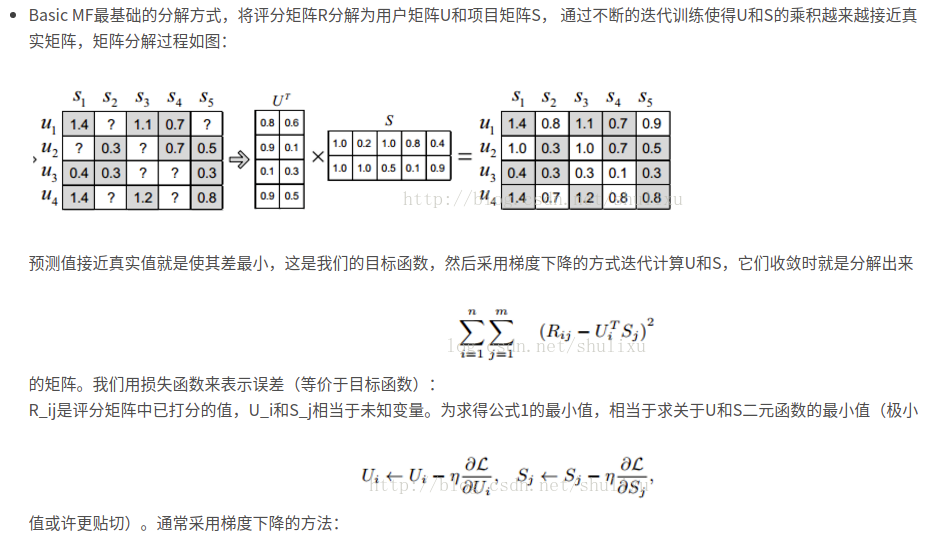
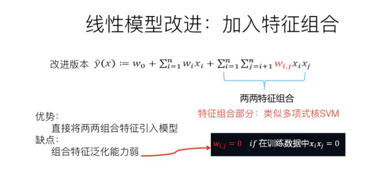
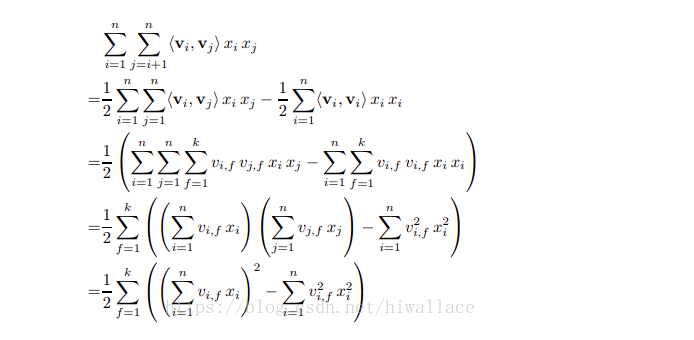
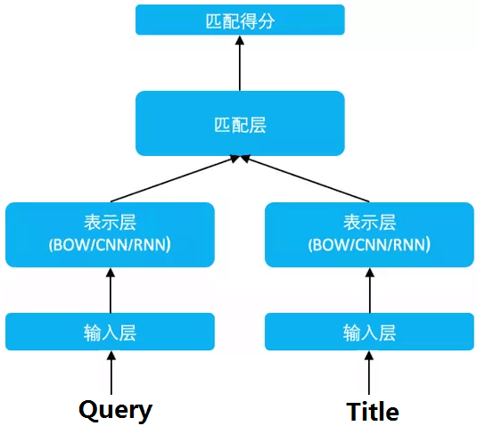
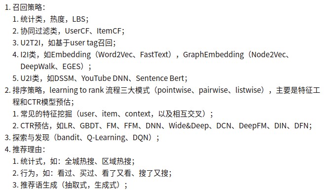

**Wide&Deep**

 文中设计了一种融合浅层（wide）模型和深层（deep）模型进行联合训练的框架，综合利用浅层模型的记忆能力和深层模型的泛化能力，实现单模型对推荐系统准确性和扩展性的兼顾。在推荐效果和服务性能均有所提升。

**MF**

**FM**&**DeepFM**

优化

这是一个降低时间复杂度的过程n^2==>kn

原式表示的是矩阵对角线上方的各元素

第一个等号将原式转化为1/2(整个矩阵和-对角线元素)

第二个等号将上式的v转化为k维向量，相当于需要一个n*k的矩阵

第三个等号将k维提取的出来，并使用结合律

第四个等号的理解为和平方-平方和==>`1/2((a+b+c)^2-(a^2+b^2+c^2))`

**SVM**

**DSSM**

通过搜索引擎里 Query 和 Title 的海量的点击曝光日志，用 DNN 把 Query 和 Title 表达为低纬语义向量，并通过 cosine 距离来计算两个语义向量的距离，最终训练出语义相似度模型。该模型既可以用来**预测两个句子的语义相似度，又可以获得某句子的低纬语义向量表达**，DSSM 从下往上可以分为三层结构：**输入层，表示层，匹配层**

Query, Title（多个负采样）需要先分词，各词查表得到序列化的序号，使用lookup得到对应的embedding

再按照一定的规则组合成原来的Query和Title

表示层可以使用DNN, LSTM, CNN来训练

匹配层衡量向量相似度

**attention**

https://www.zhihu.com/question/68482809/answer/264632289

**GraphSAGE**

**GAT**

**GCN**

**KGCN**

https://blog.csdn.net/u010159842/article/details/105939263/

**树模型**

https://blog.csdn.net/zhangkongzhongyun/article/details/109067493

树模型其实按照统计来分类的

树模型按照特征来进行树的分裂，那么那些特征先分裂，为什么这样分裂有助于分类

常理我们应该用和分类结果相关性最高的特征来分裂

我们通过统计来计算信息熵，条件熵，信息增益来衡量该特征与分类标签的相关性，也就是该特征的重要程度，其中信息熵可以用纯度来理解

**正则化缓解过拟合的理解**

限制了权重参数因为某个噪点而变得非常大？引入正则，参数的值范围可能回缩小，所以可能的模型空间相对于之前来说会减少，也就是降低了模型的复杂度

**CNN理解**

卷基层--相当于在抽取特征

池化层--相当于在做采样，是向计算能力的一种妥协

权值共享理解：所谓权值共享就是，给定一张输入图片，用一个卷积核去扫这个图，卷积核的数就叫权重，这张图的每个位置是被同样的卷积核扫的，所以权重是一样的，也就是共享。

为什么权值共享

1. 减少参数
2. 保证相同的空间，权重去提取特征

假如三通道10*10的图片(10\*10\*3)用5个3\*3的卷积核(3\*3\*5)池化后就会得到8\*8\*24

**Dropout为什么可以缓解过拟合**

* 类似bagging的思路，训练时模型由于dropout, 网络结构不一样，预测时所有节点都是激活状态，所以相当于多个网络的投票或平均结果
* 添加了稀疏性，好处，随机使节点失活可以打乱节点之间的固定依赖关系，网络中的节点不会对另一个节点的激活非常敏感

**极大似然估计理解**

通俗理解来说，**就是利用已知的样本结果信息，反推最具有可能（最大概率）导致这些样本结果出现的模型参数值！**https://zhuanlan.zhihu.com/p/26614750

